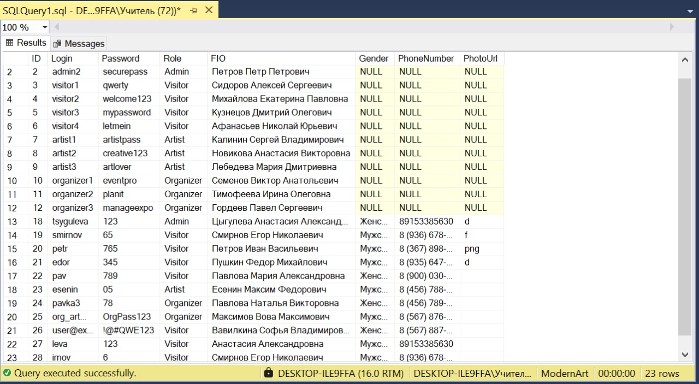
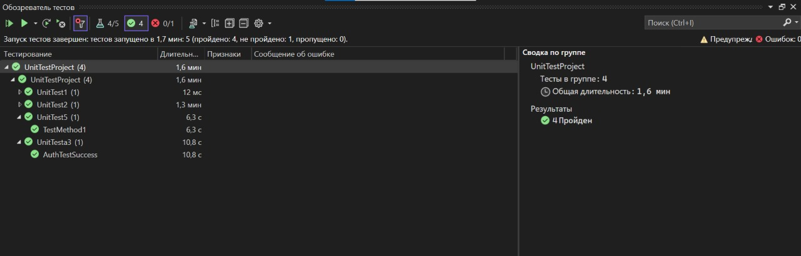

# Тесты для "Регистрации" и "Авторизации" пользователей

Приложение для регистрации пользователей с валидацией данных. Пользователи могут выбрать роль, пол и ввести другие необходимые данные.

## Результаты тестирования

- **Успешно**: Авторизация при правильных данных в `UnitTest3`, а также проверки на admin для регистрации в `UnitTest5`, и другие тесты, где введены корректные данные из SQL таблицы.
- **Неуспешно**: Некорректные данные (например, неправильный пароль, отсутствующий телефон). Рандомные данные в `UnitTest2` для входа.

## Таблица с пользователями из СУБД Microsoft SQL Server

## Скриншот окна «Обозреватель тестов»

